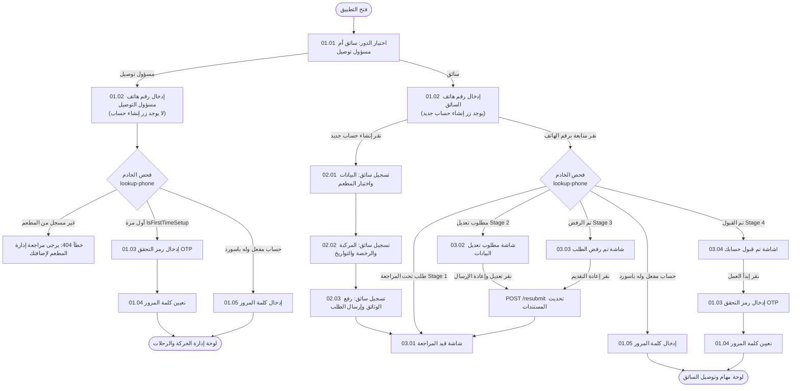

# MealMate Mobile App - Staff Screens Specification (توثيق شاشات الموبايل)

مرحباً بك في الدليل المرجعي الكامل لشاشات تطبيق الهاتف الخاص بطاقم العمل (**السائق ومسؤول التوصيل**). تم تصميم وهيكلة هذه الملفات لتكون دليلاً تقنياً شاملاً لمطوري واجهات وتطبيقات الموبايل (Flutter / React Native).

---

## 📌 القواعد الهامة والمبادئ الأساسية

1. **مسؤول التوصيل (Delivery Manager)**:
   - **لا يقوم بإنشاء حساب من التطبيق مطلقاً**. يتم إنشاء حسابه وإضافته حصرياً من قِبل المطعم عبر لوحة تحكم المطعم (`Restaurant Dashboard`).
   - دوره في التطبيق ينحصر في تسجيل الدخول فقط (إدخال الهاتف -> تفعيل الحساب برمز OTP أول مرة وتعيين كلمة المرور -> الدخول اليومي بكلمة المرور).
   - لا يظهر له زر "إنشاء حساب جديد" في أي شاشة.

2. **السائق (Driver)**:
   - يتاح له خيار إنشاء حساب جديد مباشرة من التطبيق (`02.01` إلى `02.03`).
   - يختار المطعم التابع له من قائمة مطاعم النظام النشطة المعتمدة.
   - **البريد الإلكتروني اختياري** للسائق.
   - إدخال تواريخ انتهاء الهوية والرخصة واستمارة المركبة إلزامي.
   - يخضع لـ **دورة الموافقة المزدوجة (Dual Approval)**:
     1. يراجع طلب السائق ويعتمده المطعم التابع له أولاً.
     2. تعتمد الإدارة العامة (Admin) الطلب نهائياً.
   - يتابع السائق حالة طلبه من خلال الشاشات (`03.01` إلى `03.04`).

3. **الترجمة واللغات**:
   - لا توجد أي نصوص ثابتة (Zero Hardcoded Strings). كل الشاشات تدعم اللغتين العربية (`ar`) والإنجليزية (`en`) بالتكامل مع الباك إند عبر ترويسة `Accept-Language: ar` أو `Accept-Language: en`.

---

## 🗺️ خريطة الشاشات (Screen Map)

### 1. مرحلة المصادقة والدخول (Authentication Flow)
- [01.01 - اختيار الدور (Role Selection)](screen-01.01-role-selection.md)
- [01.02 - إدخال رقم الهاتف وفحص الحساب (Phone Lookup)](screen-01.02-enter-phone.md)
- [01.03 - التحقق من رمز OTP لأول مرة (Verify First-Time OTP)](screen-01.03-verify-otp.md)
- [01.04 - تعيين كلمة المرور لأول مرة (Set Password)](screen-01.04-set-password.md)
- [01.05 - تسجيل الدخول بكلمة المرور (Login with Password)](screen-01.05-login-password.md)
- [01.06 - نسيت كلمة المرور - إدخال الهاتف (Forgot Password - Phone)](screen-01.06-forgot-password-phone.md)
- [01.07 - إعادة تعيين كلمة المرور برمز OTP (Reset Password)](screen-01.07-reset-password.md)

### 2. مرحلة تسجيل سائق جديد (Driver Registration - للسائق فقط)
- [02.01 - تسجيل سائق جديد: البيانات الشخصية واختيار المطعم (Step 1)](screen-02.01-driver-registration-step1.md)
- [02.02 - تسجيل سائق جديد: بيانات المركبة والرخصة والتواريخ (Step 2)](screen-02.02-driver-registration-step2.md)
- [02.03 - تسجيل سائق جديد: رفع المستندات والوثائق (Step 3)](screen-02.03-driver-registration-step3.md)

### 3. مرحلة متابعة حالة الطلب (Application Status - للسائق)
- [03.01 - حالة الطلب: قيد المراجعة من المطعم والإدارة (Under Review)](screen-03.01-status-under-review.md)
- [03.02 - حالة الطلب: مطلوب تعديل البيانات (More Information Needed)](screen-03.02-status-needs-changes.md)
- [03.03 - حالة الطلب: تم رفض الطلب (Application Rejected)](screen-03.03-status-rejected.md)
- [03.04 - حالة الطلب: تم قبول حسابك! (Account Approved)](screen-03.04-status-approved.md)

---

## 📊 مخطط تدفق تجربة المستخدم والتكامل (User Flow Diagram)



---

## ⚙️ معايير الاتصال بالخادم (Backend Base Configuration)
- **Base URL التطوير المحلي**: `http://localhost:5073`
- **Base URL السيرفر التجريبي**: `http://157.173.104.121:5073` (أو النطاق المعتمد)
- **الترويسات العامة الإلزامية**:
  ```http
  Content-Type: application/json
  Accept-Language: ar  # أو en حسب لغة التطبيق الحالية
  ```
